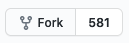
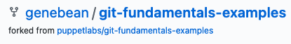

# Activity 1

This activity is a practical example of contributing to a repository. It will start with forking this repository on GitHub and end with you submitting a pull request that kicks off some automated tests.

- [Setup](#setup)
  - [Git-related settings for vim](#git-related-settings-for-vim)
  - [Install Hub (optional, but recommended)](#install-hub-optional-but-recommended)
- [Activity Instructions](#activity-instructions)

## Setup

Before we get into the actual activity, let's take a moment to do some initial setup.

### Git-related settings for vim

On most platforms, the interactive editor used when writing a commit message is vim. If you are on a non-Windows system your configuration will be stored in `~/.vimrc`. If you are on Windows then your configuration is likely going to be `C:/Users/<ME>/_vimrc`. With that establised, open a terminal and run:

1. `vim <the path to your config file>`
2. press `i` to be able to start typing
3. look for lines that start with `filetype` or `syntax`. If either exist, use the info below to edit them. If they do not exist, enter these two lines as-is into your file.

   ```vim
   filetype plugin on
   syntax on
   ```

4. press `esc` and then `:wq` to write and quit editing

These settings turn on the bare minimum to make vim automatically indicate when your commit message's summary is more than 50 characters and to make it automatically wrap commit description lines after 72 characters. You can read more about these standards at [https://chris.beams.io/posts/git-commit/](https://chris.beams.io/posts/git-commit/).

### Install Hub (optional, but recommended)

Use one of the installation methods mentioned on [here](https://github.com/github/hub#installation) to install hub.

- On macOS I suggest using [Homebrew](https://brew.sh/) and o
- On Windows I suggest using [Chocolatey](https://chocolatey.org/).
- On Linux I suggest first looking to your stock package manager and then to Homebrew.

## Activity Instructions

1. Fork this repository by clicking the

   

   button in the upper right of the [puppetlabs/git-fundamentals-examples](https://github.com/puppetlabs/git-fundamentals-examples) repository.
   - clicking that button will ask you which account you'd like to fork it to if you are a member of any orginazations. Click the one associated with your personal account.
2. After the forking process is complete, you will be directed to a new repository on GitHub that is under your account. The upper left will now look similar to this:

   

   There are three things of note in this screenshot:
   1. the left-most part has changed from a book icon to one that represents forks.
   2. the first part of the repository name now starts with your username (`genebean` in the screenshot) instead of `puppetlabs`.
   3. under the repository name it shows exactly where this one was forked from (`puppetlabs/git-fundamentals-examples` in this case).
3. Clone this repository using the cli on your computer. Here are two ways in which you can do that:
   - Option 1: the "normal" way:
     1. Click the green "Code" button
     2. make sure ssh is selected
     3. click the icon to the right of the text box that will copy the url to your clipboard
     4. open your terminal, `cd` to whereever you want to save this repository (I have a folder nameed `repos` in my home directory that I use for this)
     5. enter `git clone` followed by a space and then paste the url from your clipboard
     6. press enter
   - Option 2: the "easy" way via Hub
     1. open your terminal, `cd` to whereever you want to save this repository (I have a folder nameed `repos` in my home directory that I use for this)
     2. enter `hub clone git-fundamentals-examples` (hub automatically looks in your user's namespace for the `git-fundamentals-examples` repository)
     3. press enter
4. enter `cd git-fundamentals-examples` and press enter
5. connect your local copy of the repo to the original (upstream) one by running these commands:

   ```bash
   # The URL used here is the same as what's in your browser with .git appended to the end
   $ git remote add upstream https://github.com/puppetlabs/git-fundamentals-examples.git
   $ git fetch --all
   Fetching origin
   Fetching upstream
   From https://github.com/puppetlabs/git-fundamentals-examples
    * [new branch]      main       -> upstream/main
   ```

6. enter `git switch -c activity-01` and press enter to create a new branch named `activity-01` and to start using it. See [here](https://git-scm.com/docs/git-switch/2.23.0#Documentation/git-switch.txt--cltnew-branchgt) for documentation about this.
   - You may see this same process documented elsewhere as `git checkout -b activity-01` - that is the pre Git 2.23 syntax. [bluecast.tech/blog/git-switch-branch](https://bluecast.tech/blog/git-switch-branch/) explains this:

     > [Git 2.23](https://github.com/git/git/blob/master/Documentation/RelNotes/2.23.0.txt) came up with the new ‘ [git switch](https://git-scm.com/docs/git-switch) ’ command, which is not a new feature but an additional command to ‘**switch/change branch**’ feature which is already available in the overloaded **git checkout** command.
     >
     > Currently, the all-encompassing command – [git checkout](https://git-scm.com/docs/git-checkout) does many things. It can be used to *switch branches* and also to *restore the working tree files*.
     >
     > To separate out the functionalities, the GIT community introduced the new **git switch branch command** which is an attempt to start to scale back to the responsibilities without breaking backward compatibility.
7. edit [a/README.md](a/README.md) with your editor of choice and save the changes.
8. enter `git commit -a` in your terminal and press enter. This will open a vim-based editor unless you have explicitly configured your terminal otherwise.
   1. Press `i` to be able to start typing.
   2. Craft a commit message that follows the guidance talked about in [https://chris.beams.io/posts/git-commit/](https://chris.beams.io/posts/git-commit/).
   3. Press `esc` followed by `:wq` to write and quit the editor
